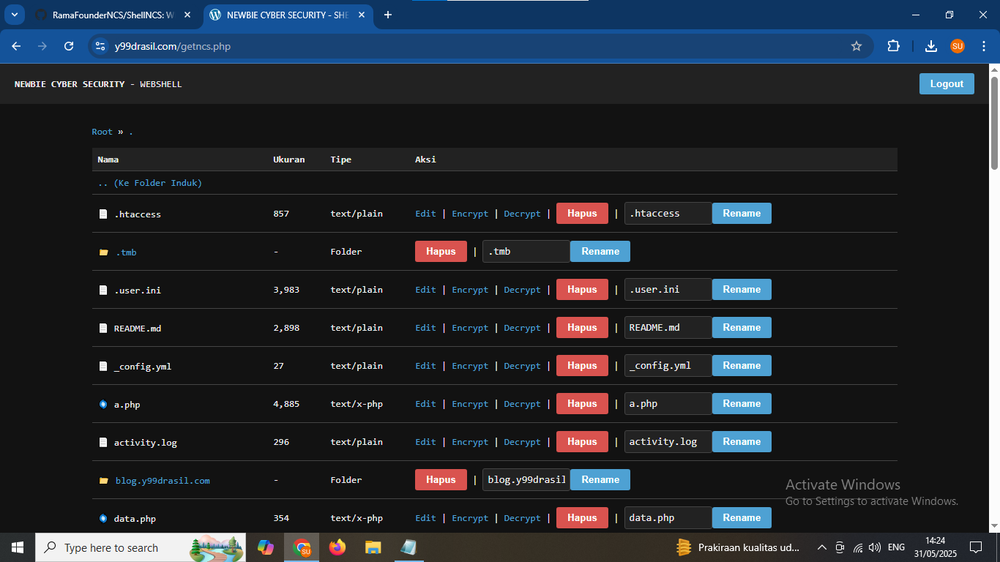

# ShellNCS - NEWBIE CYBER SECURITY Web Shell

  
*Tambahkan logo jika ada*

---

## Deskripsi

**ShellNCS** adalah web shell berbasis PHP yang dirancang untuk pemula yang ingin belajar keamanan web dan eksplorasi sistem melalui antarmuka web yang mudah digunakan.  
Shell ini memungkinkan Anda menjalankan perintah server, mengelola file, dan melakukan operasi file dengan tampilan sederhana namun fungsional.

Tujuan utama ShellNCS adalah edukasi tentang web shell, risiko keamanan, dan cara kerja eksploitasi web.

---

## Fitur Utama

- Eksekusi perintah sistem melalui antarmuka web  
- Navigasi file dan direktori  
- Upload dan download file  
- Membuat, menghapus, mengganti nama file dan folder  
- Mengedit file teks langsung dari browser  
- Tampilan responsif dan sederhana  
- Proteksi login dengan username/password default

---

## Username & Password Default

| Username | Password   |
| -------- | ---------- |
| admin    | adminncs   |

---

## Prasyarat

- Web server dengan PHP 5.6 atau lebih tinggi  
- Izin file yang memadai untuk operasi baca/tulis  
- Akses upload file aktif (opsional)

---

## Instalasi

1. Download file `shellncs.php` dari repositori  
2. Upload file ke server web Anda  
3. Pastikan izin file dan folder sudah benar  
4. Akses melalui browser:  
   ```
   http://yourdomain.com/path/to/shellncs.php
   ```

---

## Penggunaan

1. Login menggunakan username dan password default (atau yang sudah Anda konfigurasi)  
2. Jalankan perintah sistem melalui kolom perintah  
3. Jelajahi file dan direktori  
4. Upload dan download file sesuai kebutuhan  
5. Gunakan fitur buat, edit, rename, dan hapus file/folder  

---

## Peringatan Keamanan

⚠️ Gunakan ShellNCS hanya pada lingkungan yang Anda kontrol dan dengan izin yang sah.  
Shell ini dapat membahayakan jika disalahgunakan di server publik tanpa proteksi kuat.  
Selalu amankan akses dan jangan gunakan untuk aktivitas ilegal.

---

## Kontribusi

Fork repositori, buat perubahan, dan kirimkan Pull Request.  
Kami sangat menghargai kontribusi Anda.

---

## Lisensi

Proyek ini dilisensikan di bawah MIT License.  
Lihat file [LICENSE](LICENSE) untuk informasi lebih lanjut.

---

## Kontak

- Nama: Rama Founder NCS  
- Email: offcncs@gmail.com  
- GitHub: [https://github.com/RamaFounderNCS](https://github.com/RamaFounderNCS)
